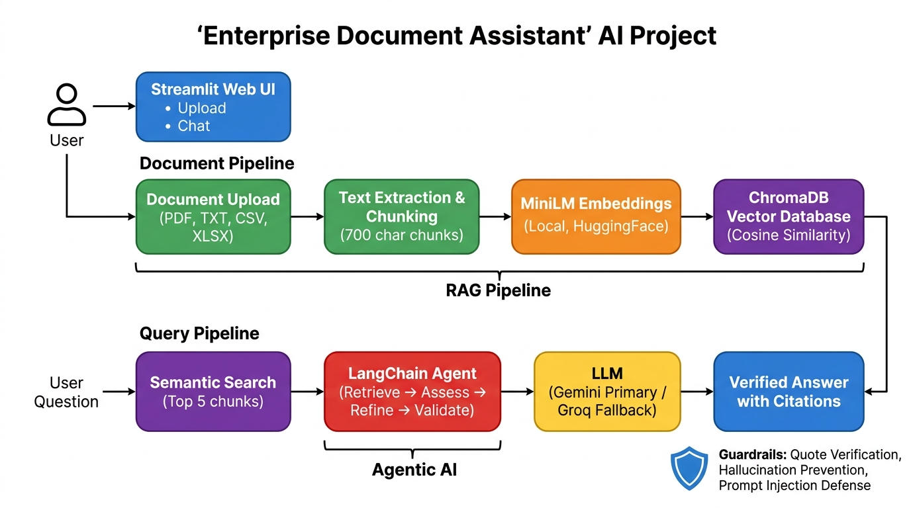

# Enterprise Document Assistant - Technical Documentation

| | |
|---|---|
| **Name** | [PUT YOUR FULL NAME HERE] |
| **Email** | [PUT YOUR EMAIL HERE] |
| **Mobile No** | [PUT YOUR MOBILE NUMBER HERE] |
| **Batch** | Morning Batch 13 |
| **Project** | Enterprise Document Assistant (Edureka GenAI Capstone) |

An AI-agent-based question-answering system for enterprise documents. Users upload PDF, TXT,
CSV or Excel files and ask questions in plain English. A **LangChain agent** searches the files
with a vector database, reasons over what it finds, and answers **only** from that evidence -
with citations that are checked by code before they are shown.

> Start with [README.md](README.md) for the step-by-step "how to run" guide.
> This document explains **how the system works** and **why it was built this way**.

**Contents**
1. [At a glance](#1-at-a-glance)
2. [System setup](#2-system-setup)
3. [Architecture](#3-architecture)
4. [How the RAG pipeline works](#4-how-the-rag-pipeline-works)
5. [Agent roles and reasoning flow](#5-agent-roles-and-reasoning-flow)
6. [Reliability and safety controls](#6-reliability-and-safety-controls)
7. [Technology stack and why](#7-technology-stack-and-why)
8. [Deployment steps](#8-deployment-steps)
9. [Testing](#9-testing)
10. [Limitations and known issues](#10-limitations-and-known-issues)
11. [Challenges faced during development](#11-challenges-faced-during-development)
12. [Future improvements](#12-future-improvements)

---

## 1. At a glance

| Item | Choice |
|---|---|
| Domain | HR / employee management (demo data), but the code is domain-independent |
| User interface | Streamlit web app (`app.py`) |
| Agentic framework | **LangChain 1.x** (`create_agent`, `@tool`, middleware) - the only agent framework used |
| Number of agents | **1** agent with **1** tool (`search_documents`) |
| Primary LLM | Google **Gemini** (`gemini-3.6-flash`) |
| Fallback LLMs | **Groq** (`qwen/qwen3.8-27b`), Groq's second model (`openai/gpt-oss-20b`), then a second Gemini model (`gemini-3.5-flash-lite`) - used automatically, in this order, when the one before fails |
| Embeddings | `sentence-transformers/all-MiniLM-L6-v2` (free, runs locally on CPU, 384 dimensions) |
| Vector database | **ChromaDB** (persistent, cosine similarity) |
| File formats | PDF, TXT, CSV, XLSX. Anything else is refused with an explanation |
| Language | Python 3.11 and 3.13 tested (3.10 and 3.12 expected to work) |

## 2. System setup

The complete beginner-level walkthrough (installing Python, opening a terminal, every command with its
expected output, troubleshooting) is in **[README.md](README.md)**. In short:

```text
python -m venv .venv                 # 1. create a private Python environment
.venv\Scripts\activate               #    activate it (Mac/Linux: source .venv/bin/activate)
pip install -r requirements.txt      # 2. install the packages
streamlit run app.py                 # 3. start the app  ->  http://localhost:8501
```

Configuration lives in a `.env` file (template: `.env.example`):

| Variable | Purpose |
|---|---|
| `GOOGLE_API_KEY` | Gemini key (primary LLM) |
| `GROQ_API_KEY` | Groq key (fallback LLM). Optional; the app works with either key alone |
| `GEMINI_MODEL`, `GEMINI_BACKUP_MODEL`, `GROQ_MODEL`, `GROQ_BACKUP_MODEL` | Optional model overrides (defaults: `gemini-3.6-flash`, `gemini-3.5-flash-lite`, `qwen/qwen3.8-27b`, `openai/gpt-oss-20b`). Names of models the provider has retired are replaced by the default automatically |
| `PRIMARY_LLM` | Optional. `groq` puts Groq first in the chain (useful when the Gemini free quota is small); default `gemini` |

Evaluators can also paste their own keys into the sidebar; those are kept only in the browser session.
`.streamlit/config.toml` switches off Streamlit's e-mail prompt, usage statistics and file watcher.

**Project layout**

```text
app.py               Streamlit UI: sidebar (LLM status, documents, sample questions) and chat
agent.py             LangChain agent, search tool, guardrails, LLM fallback chain
llm.py               LLM providers, key checks, model names, friendly error messages
ingestion.py         Multi-format loaders, file validation, chunking, uploaded_documents/ helpers
retriever.py         Local embeddings, ChromaDB store, semantic search
requirements.txt     Pinned packages          .env / .env.example   Keys and settings
sample_documents/    Four HR demo files + error_test_files/ (bad files for testing error handling)
chroma_db/           Vector database files (created at run time; empty in the submission)
uploaded_documents/  Copies of files uploaded through the UI (empty in the submission)
tests/               Offline unit tests, setup check, LLM connectivity check
run_windows.bat      Optional one-click launcher for Windows
architecture_diagram.jpg   Overview picture of the system (shown in section 3)
```

## 3. Architecture



*Figure 1 - Overview of the system ([architecture_diagram.jpg](architecture_diagram.jpg)). The picture is deliberately
simplified: its "LLM" box is really a chain of four models (Gemini -> Groq -> Groq's second model -> Gemini's second model,
see section 5), and the agent's checks include local guards that run before any LLM is called. The text diagram below
shows those details.*

```text
+--------------------------------------------------------------------------------------+
|                               Streamlit UI  (app.py)                                 |
|   sidebar: LLM status | "Load sample HR documents" | file upload | sample questions   |
|   main:    chat window  ->  answer + "Answered by <LLM>" + agent search trace + evidence|
+---------------+------------------------------------------------------+---------------+
                | files (bytes)                                        | question
                v                                                      v
+-------------------------------+                     +-----------------------------------+
|  INGESTION  (ingestion.py)    |                     |  AGENT  (agent.py, LangChain)     |
|  1 check type/size/encoding   |                     |  0 local checks: nothing relevant |
|  2 PDFLoader / TextLoader /   |                     |    or maths over rows? refuse; no |
|    CSVLoader / ExcelLoader    |                     |    LLM is called at all           |
|  3 friendly error per failure |                     |  1 PLAN   (LLM)                   |
|  4 split into ~700-char chunks|                     |  2 RETRIEVE  tool: search_documents|
+---------------+---------------+                     |  3 REASON (LLM, up to 3 searches) |
                | chunks                              |  4 ANSWER (structured output)     |
                v                                     |  5 VALIDATE quotes (plain code)   |
+-------------------------------+   semantic search   +----------+----------------+-------+
|  RETRIEVER  (retriever.py)    |<-------------------------------+                |
|  MiniLM embeddings (local)    |   top-5 passages + similarity                   | LLM call
|  ChromaDB collection (cosine) |                                                 v
|  one collection per session   |                          +------------------------------+
+-------------------------------+                          |  LLM layer (llm.py)          |
                                                           |  Gemini > Groq > Groq 2nd >  |
   uploaded_documents/  <- copy of each uploaded file      |  Gemini 2nd  (auto fallback) |
   chroma_db/           <- vector data                     +------------------------------+
```

**Data flow in one sentence:** files are cut into passages, each passage becomes a vector stored in
ChromaDB, and when a question arrives the agent retrieves the closest passages, lets an LLM write
a cited answer from them, and the code verifies every quote before showing anything.

| Module | Responsibility | Talks to |
|---|---|---|
| `app.py` | Pages, buttons, chat, status messages; never contains business logic | all others |
| `ingestion.py` | Turn bytes into `Document` chunks; reject bad files politely | LangChain loaders, pandas |
| `retriever.py` | Embeddings, vector store, similarity search | ChromaDB, HuggingFace |
| `agent.py` | Plan -> retrieve -> reason -> answer -> validate | retriever, llm |
| `llm.py` | Which LLMs are configured, how to create them, what went wrong | Gemini, Groq |

## 4. How the RAG pipeline works

RAG = *Retrieval-Augmented Generation*: the LLM is not asked to answer from memory; it is handed
the relevant passages and told to answer from those alone.

| Step | What happens | Where | Key settings |
|---|---|---|---|
| 1. Validate | File type by extension, size, text encoding (UTF-8, UTF-16, or Windows-1252 for Excel CSVs) | `ingestion.load_document` | max 20 MiB, 2 M characters, 20 000 rows |
| 2. Read | PDF -> one document per page; TXT -> one document; CSV and Excel -> one document per row with `column: value` lines | LangChain loaders + custom `ExcelLoader` | provenance kept: file, page / row, sheet |
| 3. Chunk | Recursive splitting on paragraphs, lines, then words | `chunk_documents` | 700 characters, 100 overlap |
| 4. Embed | Each chunk becomes a 384-number vector by `all-MiniLM-L6-v2` on the CPU | `retriever.get_embeddings` | normalised vectors |
| 5. Store | Vectors + text + metadata go into a ChromaDB collection; IDs are content hashes so re-indexing never duplicates | `index_chunks` | cosine space, batches of 128, thorough HNSW index (M=64, ef_construction=800) |
| 6. Retrieve | The question (or the agent's search query) is embedded; the nearest chunks are returned | `semantic_search` | top 5, similarity >= 0.30, HNSW ef_search=2000 |
| 7. Generate | The LLM receives the passages (via the tool result) and writes claims with quotes | agent + LLM | temperature 0.1 |
| 8. Validate | Every quote must appear word-for-word (ignoring line breaks) in the cited passage | `DocumentAgent._validate` | otherwise: refuse |

Each browser session gets its **own collection** (`docs_<random id>`), so two users never see each
other's documents. A copy of each uploaded file is kept in `uploaded_documents/<session>/`; both that
copy and the collection are deleted by **Clear knowledge base** and by the next app start.

Chroma reports cosine *distance* (small = close); the code converts it to similarity (`1 - distance`)
explicitly instead of trusting an integration default.

## 5. Agent roles and reasoning flow

There is **one agent**, created with LangChain's `create_agent`. It has **one tool**. Keeping it small was
a deliberate choice: the assignment says not to complicate the project, and a single well-guarded agent
is easier to test and explain than a crew of agents.

| Role | Played by | Job |
|---|---|---|
| **Planner** | the LLM | Decide what the question is about and which words a matching passage would contain |
| **Retriever** | tool `search_documents(query)` | Semantic search in the user's documents; returns numbered passages |
| **Reasoner** | the LLM | Read the passages and decide: answer, or refuse - and if refusing, why |
| **Answerer** | the LLM via structured output (`GroundedDraft`) | Produce claims, each with a `source_id` and a verbatim quote |
| **Validator** | plain Python (no LLM) | Check every quote against the real passage text; block anything invented |

**Reasoning flow**

```text
question
  |
  v
[local pre-check] --- nothing similar in the documents? ---> polite refusal (no LLM is called)
  |
  v
PLAN     "which words would appear in a matching passage?"
  v
RETRIEVE search_documents("keyword query")        <- may repeat, at most 3 searches
  v
REASON   "do these passages fully answer the question?"
  v
ANSWER   GroundedDraft { outcome, claims[ {text, evidence[ {source_id, quote} ]} ] }
  v
VALIDATE every quote found word-for-word in its passage?
  |-- yes --> answer with [1] [2] citations + evidence cards + "Answered by Gemini"
  '-- no  --> polite refusal (a hallucinated citation never reaches the user)
```

`outcome` is one of `answered`, `not_in_documents`, `needs_calculation`, `unclear_question` or
`unsafe_request`. The model only *chooses* the outcome; the refusal wording is fixed in code
(`REFUSAL_MESSAGES`), so a refusal can never be talked into saying something else.

**LLM fallback.** The providers form an ordered chain: **1. Gemini** (`gemini-3.6-flash`) -> **2. Groq**
(`qwen/qwen3.8-27b`) -> **3. Groq's second model** (`openai/gpt-oss-20b`) -> **4. a second Gemini model**
(`gemini-3.5-flash-lite`). The two main models come first (a different company is the best spare), then each
company's second model, which has its own rate-limit bucket. If a call raises any error (invalid key, quota, overload,
timeout), the *same agent* is re-run with the next provider; with several providers configured the first failure is
not retried, it simply moves on (a lone provider gets one retry). A model that returns a *malformed tool call* - a known
glitch of some open models - is retried once before moving on.

A failed provider is tried last for a while, and how long depends on why it failed: the delay the provider asks for in
its "try again in ..." message (per-minute limits, typically seconds), 15 minutes for daily limits, 3 minutes for an
unexplained rate limit, 90 seconds for an outage. The sidebar shows whether each provider's key and model are accepted (a
cached, **quota-free** metadata check - free tiers allow only a few generation requests, so a status light must not spend
them), and every answer says which LLM produced it. Providers without a key are simply left out of the chain.

**What the user sees.** Under each answer: which LLM answered, the searches the agent ran (its "trace"),
and an *Evidence* panel with the exact quotes and source (file, page or row).

## 6. Reliability and safety controls

| Risk | Control |
|---|---|
| Unsupported files (`.docx`, `.zip`, `.xls`, images, ...) | Extension check first; a specific message says what the file is and what to do (e.g. "Save As PDF") |
| Empty, blank, scanned, header-only files | Skipped with a reason ("has no selectable text - OCR is not supported") |
| Corrupted, renamed or password-protected files | Loader errors become short, per-format messages; other files keep loading |
| Oversized or malicious files | 20 MiB per file, 25 MB uploader cap, character and row limits, Excel expanded-size check |
| Path tricks in file names | Only the final, sanitised name is used; loaders read a temp file with a fixed name |
| Odd encodings | UTF-8, UTF-16 with BOM, Windows-1252 (Excel's default CSV); binary data is refused |
| Long / empty questions | Input limited to 2000 characters; empty questions rejected |
| Hallucination | Answers only from retrieved passages; every claim needs a verbatim, code-verified quote; otherwise refusal |
| No relevant data | Local similarity threshold; the LLM is not even called |
| Spreadsheet maths | Rows are retrieved one by one, so counts / averages / rankings are never computed. Three layers: (1) a **local check** - a calculation word ("how many", "average", "highest", ...) plus best matches that are spreadsheet rows -> refusal **before any LLM call**; (2) the prompt tells the model to answer `needs_calculation`; (3) a **safety net** after validation: an answer that combines 3 or more different spreadsheet rows is discarded. Layers 1 and 3 are plain code, so a weak or misbehaving model cannot get around them |
| Prompt injection (in questions or documents) | Text is declared untrusted data; the agent has no tools except search; refusal wording is fixed; the answer is validated afterwards |
| LLM outage, quota or retired model | Automatic fallback through up to four models (two companies); a retired model name in `.env` is replaced by the current default; if all fail, a clear message without raw error text |
| Secrets | Keys live in `.env` (git-ignored); never shown in the UI or logs (`redact`, `repr` hidden); sidebar override is session-only |
| Runaway agent | Max 3 searches per question, step limit, 60 s LLM timeout |
| Privacy | Embeddings run locally; only the retrieved passages leave the machine (to the LLM); chat tracing is off |
| Missing internet on first start | The embedding-model download failure is caught and explained |

## 7. Technology stack and why

| Tool | Used for | Why this one |
|---|---|---|
| **Streamlit** | UI | A chat + upload interface in ~250 lines of Python; the assignment asks for a simple UI |
| **LangChain 1.x** | Agent, tool, loaders, splitter, integrations | One framework covers loaders, chunking, vector store, LLM wrappers *and* the agent (`create_agent`), so nothing else is needed |
| **Gemini** (`langchain-google-genai`) | Primary LLM | Free tier, good tool calling and structured output, generous context |
| **Groq** (`langchain-groq`) | Fallback LLM | Free tier, very fast (answers in 2-3 s), a different company - a real second option when Gemini is down or out of quota. Two models are used (`qwen/qwen3.8-27b`, `openai/gpt-oss-20b`), chosen by benchmark - see challenge 16 |
| **sentence-transformers MiniLM** | Embeddings | Free, ~90 MB, runs on any CPU, no API key, documents are not sent anywhere |
| **ChromaDB** | Vector database | Embedded (no server), persistent, cosine search, first-class LangChain integration |
| **pypdf / pandas / openpyxl** | Reading PDF / CSV / Excel | Pure-Python, no system dependencies (no Java, no poppler) |
| **pydantic** | Structured output schema | Guarantees the model's answer has the fields the validator needs |
| **python-dotenv** | Config | Standard way to keep keys out of the code |

## 8. Deployment steps

**A. Run locally from the ZIP (the main, tested path)** - follow [README.md](README.md). Windows users can
also double-click `run_windows.bat`, which creates the environment, installs the packages and starts the app.

**B. Streamlit Community Cloud (optional, free, gives a public link)**
1. Push the repository to GitHub (the real `.env` is git-ignored and is never pushed).
2. Go to <https://share.streamlit.io>, sign in with GitHub, choose **New app**, select the repository,
   branch `main`, main file `app.py`.
3. Open **Advanced settings -> Secrets** and paste:
   ```toml
   GOOGLE_API_KEY = "your key"
   GROQ_API_KEY = "your key"
   ```
   (The app reads secrets from the environment, and Streamlit exposes them there.)
4. Deploy. The first build installs PyTorch, which is slow; the free tier has about 1 GB RAM, which is tight
   for the embedding model. If the app runs out of memory, use option C.
5. Use a dedicated, free-tier key for a public app: anyone with the link spends its quota.

**C. Hugging Face Spaces (optional, more memory)** - create a *Streamlit* Space, upload the project files,
add the keys under *Settings -> Repository secrets*. Free CPU Spaces have 16 GB RAM.

**Why not Netlify or Vercel?** They host static sites and short serverless functions. Streamlit needs a
long-running Python server with WebSocket connections, and PyTorch plus ChromaDB are larger than their
function-size limits, so the app cannot run there.

## 9. Testing

| Check | How to run | What it proves |
|---|---|---|
| Unit tests (offline, ~5 s) | `python -m unittest discover -s tests -v` | 61 tests: every bad-file type, encodings, agent guardrails with a scripted fake LLM, invented-quote rejection, the local calculation guard and cross-row safety net, provider order and fallback, retired-model replacement, rate-limit parsing and cooldowns, key redaction |
| Setup check | `python tests/verify_setup.py` | Real embeddings + ChromaDB on the sample data; unrelated questions never reach an LLM |
| LLM check | `python tests/check_llm_apis.py` | Each configured API key really works |
| Manual test guide | README -> "Testing Guide" | 10 questions that must be answered, 10 that must be declined, and the bad-file uploads |

### Results of the test runs

| Test | Result |
|---|---|
| Offline unit tests (fresh virtual environments, pinned `requirements.txt`) | **61 / 61 passed** on Python 3.11 **and** on Python 3.13, in about 5-8 s |
| Indexing the four sample files (2,269 passages) | about 40 s on a laptop CPU; a search takes about 20 ms |
| Retrieval quality of the vector index (16 questions x 8 fresh index builds, compared with exact brute-force search) | **0 / 128 misses** with the final settings (10 / 80 misses with ChromaDB's default settings - see challenge 14) |
| Live agent test - 10 answerable questions on the sample data (README, Testing Guide A) | **10 / 10 correct**, each with a verified citation; 4-8 s per answer; the agent refined its own search query when the first one was not enough (e.g. the "acknowledge by which date" question) |
| Live agent test - questions that must be declined (Testing Guide B) | **10 / 10 declined safely**: 2 aggregation questions -> "needs calculations" by the local guard **without any LLM call**; 6 off-topic / injection / secret-stealing / vague questions -> refused by the local guard without any LLM call; "highest paid" and the privacy question (home address) -> refused by the agent after a search |
| Live run of all 20 Testing Guide questions through the real provider chain while Gemini's main model was unavailable and Groq was rate-limiting | all 10 answerable questions correct with citations (2-10 s each), all 10 declined; the chain handed over Groq (Qwen) -> Groq (gpt-oss-20b) -> Gemini backup by itself as limits were hit |
| Groq model benchmark (real agent, one model at a time, 13 questions) | `qwen/qwen3.8-27b` **13 / 13**; `openai/gpt-oss-20b` 12 / 13 (one vague answer); `openai/gpt-oss-120b` 2 / 13 (9 malformed-tool-call errors) |
| Browser test of the real UI (headless Chromium) | sidebar status, sample load, sample-question buttons, upload of all 7 error-test files at once (6 bad ones each explained, the valid CSV still indexed), Clear, "add documents first" message, wrong-key handling: all behaved as documented |
| Provider failures met during testing | Gemini `503 high demand` and `429 quota` were both handled: clear message, automatic switch to the next provider, no crash |

Note for transparency: while these live tests ran, `gemini-3.6-flash` was intermittently overloaded on Google's side
(503) and its free-tier quota was hit (429), so the live answers came from the Groq models and from the backup Gemini
model `gemini-3.5-flash-lite`; the primary Gemini model itself was therefore exercised only in the sidebar key check. Run
`python tests/check_llm_apis.py` to verify every configured model with your own keys.

## 10. Limitations and known issues

- **No calculations across rows.** CSV/Excel rows are retrieved individually, so "how many", "average",
  "highest paid" questions are refused on purpose. A table-analysis tool (pandas) would be the fix.
- **Retrieval is approximate.** With 1000-row spreadsheets, a question about a person is answered only if
  that person's row is among the top 5 matches; unusual names or spellings can be missed. The vector index is tuned
  to be near-exhaustive (0 misses in 128 test queries), but approximate search can never be *proven* exact.
- **No OCR.** Scanned PDFs and images contain no text to read.
- **English-centric embeddings.** MiniLM works best in English and truncates long chunks (about 256 word-pieces).
- **Not a source of truth.** Quote validation proves the *quote exists*, not that the quote fully answers the question.
- **No conversation memory.** Every question is answered on its own; follow-ups such as "what about him?" are refused.
- **Session-scoped knowledge base.** Refreshing the browser starts a new, empty session; the vector data is also
  wiped on app restart.
- **First start needs internet** to download the embedding model (about 90 MB) and, later, to reach the LLMs.
- **Free-tier limits.** The Gemini free tier allowed only about **20 generation requests per day per model** on the key used for
  development (each question needs 2-3 requests), so a long test session exhausts it. The Groq step of the chain (and `PRIMARY_LLM=groq`) exists
  for exactly this; a billing-enabled key removes the limit.
- **Retrieved text leaves the machine.** The passages sent to Gemini/Groq are processed by those providers; do not
  use regulated or confidential data without an approved agreement.
- **Answer quality differs between models.** Qwen and Gemini answered every test question correctly; the smaller
  `gpt-oss-20b` once gave a vague answer without the e-mail address. The validator and the local guards keep every model
  safe (no invented quotes, no invented calculations), but a weaker model can be less helpful.
- **Providers retire models without notice.** Groq removed `llama-3.3-70b-versatile` (and the other older models) while this
  project was being finished. Names are configurable, retired names are replaced by defaults, and the status light checks
  that the configured model really exists - but the defaults themselves will need updating over time.
- **Single-machine design.** ChromaDB runs inside the app process; a multi-user deployment needs a hosted vector database and login.

## 11. Challenges faced during development

1. **Retired Gemini models (404 NOT_FOUND).** Older model names (`gemini-1.5-*`, `gemini-2.5-*`) stopped working for new
   keys, and a stale name in `.env` made the whole app fail. *Fix:* one place (`llm.py`) resolves the model name, and known-retired
   names are replaced by the current default automatically.
2. **Keeping citations honest.** An LLM can paraphrase or even invent a "quote", and a prompt alone cannot prevent that.
   *Fix:* structured output plus a code-level check that every quote exists in the retrieved passage; anything else is refused.
3. **Distance vs. similarity in ChromaDB.** Chroma returns cosine *distance*; treating it as similarity inverts the ranking.
   *Fix:* explicit conversion (`1 - distance`) and a unit-tested threshold.
4. **Windows file locking.** Loaders re-open the file they are given, which fails while Python still holds it on Windows.
   *Fix:* write the upload to a temporary directory and let the loader open it after the write is closed.
5. **Spreadsheets are not paragraphs.** One row = one tiny chunk, so totals and averages cannot be found by similarity search.
   *Fix:* explicit refusal category (`needs_calculation`) and honest documentation, instead of letting the LLM guess.
6. **Heavy optional dependencies.** LangChain's generic Excel loader pulls in the large `unstructured` package.
   *Fix:* a small custom `ExcelLoader` on top of pandas/openpyxl, with an expanded-size safety check.
7. **Embedding model limits.** MiniLM only reads about 256 word-pieces, so long chunks lose their tail.
   *Fix:* 700-character chunks with overlap.
8. **Friendly errors for unsupported files.** Streamlit's upload widget rejects unwanted extensions itself with a
   generic message, so our own explanations were never reached. *Fix:* the widget accepts any file and our validator explains
   exactly what is wrong and what to do.
9. **Excel-style CSV files.** CSVs saved by Excel use Windows-1252, not UTF-8, and failed with a vague error.
   *Fix:* encoding detection (UTF-8, UTF-16, Windows-1252) before loading.
10. **Two LLM providers, one contract.** Gemini and Groq differ in structured-output support.
    *Fix:* the answer schema is delivered as a tool call, which both support, and the same validator runs after either.
11. **Noisy first run for beginners.** Streamlit's e-mail prompt, the file-watcher warnings from PyTorch and PDF warnings
    confused new users. *Fix:* `.streamlit/config.toml`, quieter logging, and a README that explains every message.
12. **Unneeded packages.** `torchvision` (a large download) was in the requirements although nothing uses it; it was removed
    after checking that nothing depends on it, and a clean install from scratch was tested without it.
13. **Overloaded and rate-limited free-tier models.** During testing the newest Gemini model returned `503 high demand`
    for long stretches and `429 quota exceeded` (limit: 20 requests per day per model) after a burst of questions. The first
    version of the sidebar status light sent a real test message every few minutes and would have burned that quota by itself;
    it now uses a metadata call that costs no generation quota. *Fix:* retries with short timeouts, the
    provider chain (Gemini -> Groq -> second Gemini model), a "try it last" cool-down for a failing provider (15 min after a quota
    error, 90 s after an outage), a sidebar that shows each provider's key status, and error messages that say *busy* or *quota*
    instead of a stack trace.
14. **The vector index silently missing the right passage.** A browser walk-through refused a perfectly answerable question
    ("Who should I report suspicious emails to?") with "no evidence found", although the memo paragraph was stored and a
    second index of the same files found it. The cause: ChromaDB's default HNSW index is approximate, and six policy paragraphs
    among 2,000+ near-identical spreadsheet rows are exactly the outliers it can fail to reach - and it depends on how the graph
    happened to be built. Measuring against exact brute-force search showed the true best passage missing from the top 5 in
    **10 of 80** queries with the defaults, 3/80 with moderately larger settings, and 0/128 with M=64, ef_construction=800,
    ef_search=2000 (`retriever.HNSW_SETTINGS`). `tests/verify_setup.py` now contains that scenario as a regression check.
    An attempted alternative - keeping everything in Chroma's brute-force buffer via `batch_size` - did not give exact search
    in this version, so it was not used.
15. **Terminal encodings on Windows.** A setup-check script that printed check-mark symbols crashed on classic Windows consoles
    (cp1252/cp437 cannot encode them), and cleaning up a temporary ChromaDB folder failed while Windows still held the file.
    *Fix:* plain-text `[OK]` / `[FAILED]` markers and tolerant cleanup - found only by running the scripts the way an evaluator would.
16. **Groq retired the model, and the replacements were not equally good.** The first Groq default,
    `llama-3.3-70b-versatile`, disappeared from the account ("model not found"), and so did the other well-known names
    (`llama-3.1-8b-instant`, `gemma2-9b-it`, `mixtral-8x7b-32768`). Only three general chat models were left. Benchmarking
    them inside the real agent (one at a time, 13 questions) showed: `openai/gpt-oss-120b` failed 9 of 13 with Groq's
    `tool_use_failed` error (the model tries to call a tool named "commentary"); `openai/gpt-oss-20b` worked but once
    answered vaguely, and - more seriously - when it was used as a fallback it **answered "the average salary is
    $118,535.59" and "there are five employees in Sales" by combining just five retrieved rows**. The quotes existed, so
    citation checking passed. *Fix:* `qwen/qwen3.8-27b` (13/13) became the default with `gpt-oss-20b` as its backup,
    `gpt-oss-120b` is blocked like a retired model, and the "no maths over rows" rule stopped depending on the model:
    a local keyword guard runs before any LLM call and a cross-row safety net discards answers built from three or more
    spreadsheet rows. Qwen's "thinking" is switched off (its tokens count against Groq's small per-minute limit), malformed
    tool calls are retried once, and rate-limit messages are parsed for the "try again in ..." delay.
17. **A status code hidden in a token count.** The error classifier treated any message containing "401" as "API key rejected",
    so a Groq rate-limit message with "Requested 4013 tokens" would have blamed the key. *Fix:* status codes are matched as
    whole numbers only, with a regression test.

## 12. Future improvements

- **Table-analysis tool** for the agent (safe, whitelisted pandas operations) so "average salary by department" works.
- **Hybrid search** (keyword + vector) and a **re-ranker** to find exact names and IDs more reliably.
- **OCR** (e.g. Tesseract) for scanned PDFs and images; `.docx` support.
- **Conversation memory** and follow-up question rewriting.
- **Streaming answers** and a "stop" button.
- **Hosted vector database** (e.g. Chroma server, pgvector) with user login for multi-user use.
- **Gemini embeddings option** so no model download is needed.
- **Evaluation set** with automatic scoring of answer accuracy and refusal behaviour.
- **Docker image** for one-command deployment.
